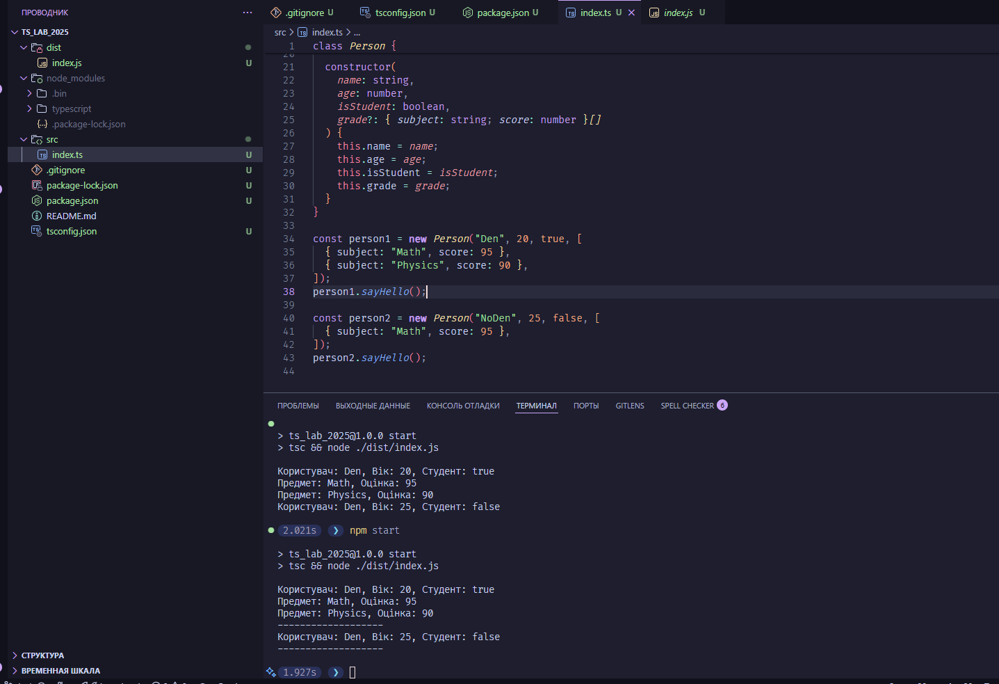

# TS_LAB_2025

Лабараторні роботи з ts

Завдання 1

Створити новий репозиторій з двома основними гілками: main та develop.
У кореневій директорії створити файл README.md з коротким описом репозиторію українською мовою.
У гілці develop встановити як залежність проєкту.

Створити конфігураційний файл tsconfig.json та налаштувати в ньому базові параметри
target (наприклад, ES6),
module (наприклад, commonjs),
strict (увімкнути строгий режим),
rootDir (наприклад, src),
outDir (наприклад, dist).

Створити директорію src та файл index.ts з прикладом простого TypeScript-коду, що використовує базові типи (string, number, boolean).

Переконатися, що компіляція проходить успішно, і згенерований JavaScript-код зберігається у папці dist.
Закомітити всі зміни у гілку develop.Надати посилання на репозиторій у завданні

[resourse](https://www.w3schools.com/typescript/typescript_getstarted.php?authuser=1)

## Preview

