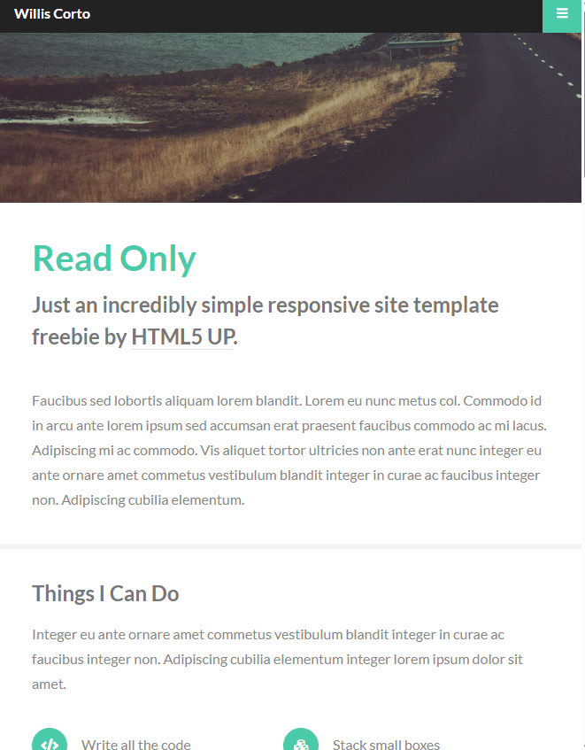

# TS_LAB_2025

Лабараторні роботи з ts

Завдання 2

1. На вже створеному git репозиторїї створити гілку feature/tsconfig
2. Знайти готовий шаблон html/css та додати його у гілку feature/tsconfig
3. Після додавання шаблону встановити у гілку feature/tsconfig typescript (приклад команди є у лекції)
4. Додати у шаблон javascript інтерактивності (відкриття модальних вікон, event listeners такі як scroll або click, анімації, fetch даних та їх відображення з https://jsonplaceholder.typicode.com/)
5. Увесь JS код писати у файлі ts та прописувати примітивні типи. Файл ts повинен конвертуватись у js.
6. У шаблон html підключити скомпільований js файл.
7. Після того як ви встановите typescript, налаштуєте tsconfig та додасте інтерактивності, все потрібно запушити на гілку feature/tsconfig.
8. Після додавання роботи у гілку feature/tsconfig з неї треба створити github pages https://pages.github.com/
9. У відповідь на завдання скинути посилання на гілку feature/tsconfig та посилання на сайт котрий відображається у github pages.
10. Описати усю інтерактивність, яку ви додали на сайт у коментарях до завдання.

---

Завдання: 4

1. Перенести код з практичної роботи №2 у нову гілку feature/modules
2. Увесь .ts код логічно розбити на модулі. Модулі повинні знаходитись в окремих папках. Типи також треба винести в окремий файл та в окрему папку.
3. Усі модулі підключити в головний main.ts файл. Якщо модуль якимось чином залежить від іншого модуля або типу, то треба імпортувати модуль у модуль або тип у модуль, а потім імпортувати обʼєднані модулі у файлі main.ts.
4. Всі функції у коді повинні бути типізованими.
5. У коментарях до зданої роботи, треба надати посилання саме на папку з вашими файлами .ts, в котрій знаходиться файл main.ts та папки з модулями та типами.

## BEFORE

## AFTER

додана кнопка яка отримує фото с апи та показує їх на сторінці
